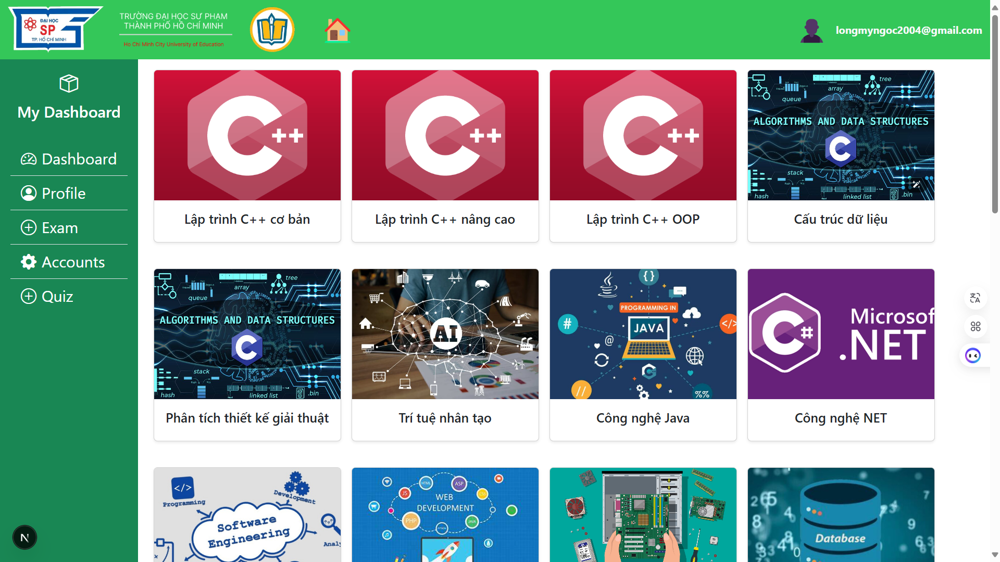

# Multiple Choice Exam System (FRONT-END)
<p align="center">
  
  
</p>

## Giới Thiệu
**Multiple Choice Exam System** là một nền tảng hỗ trợ đánh giá và kiểm tra kiến thức của sinh viên thông qua hình thức thi trắc nghiệm trực tuyến. Hệ thống cho phép người dùng tham gia thi, quản lý câu hỏi, theo dõi kết quả, và hỗ trợ xác thực người dùng.

## Tính Năng Chính
- **Đăng ký & Đăng nhập**: Người dùng có thể đăng ký tài khoản và đăng nhập bằng Email/Password hoặc Google.
- **Quản lý bài thi**: Tạo, chỉnh sửa và xóa bài thi trắc nghiệm.
- **Làm bài thi**: Sinh viên có thể tham gia bài thi, trả lời câu hỏi, và nộp bài.
- **Chấm điểm tự động**: Hệ thống sẽ tự động tính điểm ngay sau khi bài thi được nộp.
- **Xem kết quả & Lịch sử thi**: Sinh viên có thể xem lại kết quả và lịch sử thi của mình.
- **Quản lý câu hỏi**: Giảng viên có thể tạo bộ câu hỏi và chỉnh sửa nội dung câu hỏi.
- **Báo cáo & Thống kê**: Hệ thống cung cấp báo cáo về kết quả thi của sinh viên và phân tích xu hướng điểm số.

## Công Nghệ Sử Dụng
- **Firebase Firestore**: Lưu trữ dữ liệu người dùng và kết quả học tập.
- **Firebase Authentication**: Xác thực và quản lý người dùng (sinh viên, giáo viên, quản trị viên).
- **Next.js**: Framework hiện đại để xây dựng giao diện React tối ưu cho SEO và hiệu suất cao.
- **Bootstrap**: Thiết kế giao diện UI/UX trực quan và dễ sử dụng.
- **Vercel**: Triển khai và chạy hệ thống trên môi trường production.

## Yêu Cầu Hệ Thống
- **Node.js** phiên bản **20.17.0** (Cần cài đặt trước khi chạy dự án).
- **Git** (Để clone repository từ GitHub).

## Cài Đặt & Chạy Dự Án
### 1. Clone Repository
```bash
git clone https://github.com/LongMyNgoc/Multiple-Choice-Exam-System.git
cd Multiple-Choice-Exam-System
```

### 2. Cài Đặt Dependencies
Chạy lệnh sau để cài đặt các thư viện cần thiết:
```bash
npm install
```

### 3. Khởi Động Server Phát Triển
Chạy lệnh sau để khởi động dự án:
```bash
npm run dev
```
Sau khi chạy, hệ thống sẽ khởi động tại `http://localhost:3000`.

## Liên Kết Hệ Thống
- **Back-End (GitHub)**: 
- **Back-End (Render)**: 
- **Front-End (GitHub)**: [Multiple-Choice-Exam-System](https://github.com/LongMyNgoc/Multiple-Choice-Exam-System.git)
- **Front-End (Vercel)**: [Xem website](https://multiple-choice-eta.vercel.app/)

## Đóng Góp & Phát Triển
Mọi ý kiến đóng góp hoặc báo lỗi có thể được gửi qua hệ thống quản lý mã nguồn của dự án trên GitHub. Chúng tôi rất hoan nghênh sự tham gia của bạn để cải thiện hệ thống!

### Đóng Góp
1. Fork repository.
2. Tạo nhánh mới (`git checkout -b feature-new-feature`).
3. Commit thay đổi (`git commit -m 'Thêm tính năng mới'`).
4. Push lên GitHub (`git push origin feature-new-feature`).
5. Tạo Pull Request.

## Thông Tin Liên Hệ
📧 Email: nguyenphilong.dev@gmail.com <br>
📌 GitHub: [LongMyNgoc](https://github.com/LongMyNgoc) <br>
📌 Vercel Deployment: [Multiple-Choice-Exam-System](https://multiple-choice-eta.vercel.app/)